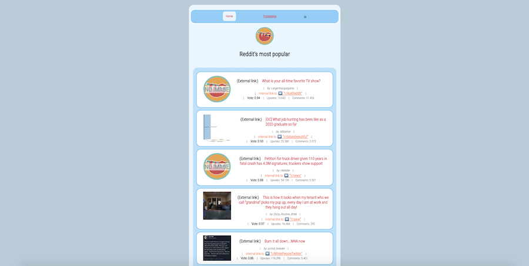

# Introductie

Dit is een Single Page Application die de top 15 posts op Reddit toont. Ik heb dit React project from scratch gemaakt.

* Link naar de README van de opdracht: [Markdown reddit opdracht](README_OPDRACHT.md).
* Link naar de PDF van de opdracht: [PDF reddit opdracht](REACT_Les5RedditOpdracht.pdf).

#### Eindresultaat:

## Wel gedaan

- Tijdens het ophalen van de data kan de gebruiker duidelijk zien dat er informatie geladen wordt via het draaiende loading SVG'tje;
- Als er iets mis gaat bij het ophalen van de data, verschijnt er een foutmelding op de pagina;
- Op de subreddit-pagina staat een SVG-icoon voor de `< Back to overview`-link
- In het tabblad wordt een eigen Favicon en Titles weergegeven (= mijn eigen *luiaard* avatar)
- Eigen styling en layout;
- Een duidelijke `README.md` met installatiehandleiding (scroll naar beneden voor installatie hulp).

## Niet gedaan

- ik weet geen universele manier om _alle_ getallen in 1X om te zetten naar nette puntnotatie.
- ik wil dat het navigatiemenu meeverandert met de 'active link' color zodra je op de subreddit pagina komt, maar dit lukt niet; die stijl verandert alleen als je echt OP het menu item klikt...?

## De Applicatie installeren en starten

Als je het project gecloned hebt naar jouw locale machine, en je in de juiste directory staat, installeer dan eerst de node_modules door het volgende commando in een terminal te runnen:

`npm install`

Als je dit project opent in een IDE zoals Webstorm dan kun je ook het NPM START afspeelknopje gebruiken.

Wacht na de installatie geduldig totdat alle depencies geïndexeerd zijn. Wanneer dit klaar is, kun je de applicatie starten met behulp van:

`npm start`

Open http://localhost:3000 om de pagina in een browser te bekijken.

*Handig:*

- Axios, React Router 5.2 (legacy), en React-Hook-Form zijn reeds gesaved in JSON package builder, dus die installeren vanzelf mee bij een `npm install`.

- In de terminal kan de front-end app gestopt worden met `ctrl` + `'C'`.

## Hoe te gebruiken

* Ga naar http://localhost:3000/
* Klik op 1 van de roze-gekleurde namen van een Subreddit;
* Je wordt nu doorgestuurd naar de dynamisch gegenereerde info-pagina over die specifieke Subreddit;
* bijvoorbeeld: http://localhost:3000/explainlikeimfive 
* Het navigatiemenu is ook bruikbaar (maar niet 100% dynamisch);
* Er zit een extra pagina bij met de meest populaire post, als extraatje.

### Stappenplan voor beginners

1. Zet een nieuw project op in React
2. Initialiseer Git (met commando: git init)
3. Stage jouw bestanden + maak een commit
4. Maak een repository op GitHub aan en push daar jouw main branch naartoe
5. Maak een nieuwe branch (git checkout -b uitwerkingen)
6. Begin daar met het maken van twee pagina's
7. Installeer react-router-dom en implementeer routing voor jouw twee paginas
8. Zet een aantal elementen op de pagina's als dummy-tekst
9. Begin dan pas met het ophalen van ECHTE data op de home pagina

### API

https://www.reddit.com/hot.json?limit=15